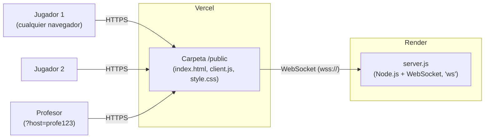

# Memoria de despliegue — 8 BITS BATTLE en la nube

Este documento explica cómo se ha llevado el juego **8 BITS BATTLE** (originalmente pensado para jugarse en red local con Node.js y un `.bat`) hasta convertirlo en un juego accesible desde una **URL pública**, jugable por cualquier persona desde cualquier red, y arrancable con `npm run dev`.

## 1. Objetivo del ejercicio

El enunciado pedía:

1. Modificar el proyecto y subirlo a Vercel.
2. Que al ejecutar `npm run dev` se abra el juego ya desplegado.
3. Que el juego sea accesible desde el navegador mediante una URL pública.
4. Que **cualquier usuario, desde cualquier IP**, pueda conectarse a esa URL y jugar.

## 2. El problema de partida

El proyecto original funcionaba así:

- Un único `server.js` con Node.js abría un servidor HTTP + WebSocket (librería `ws`) en el puerto 3000.
- Ese mismo servidor servía los archivos del cliente (`index.html`, `client.js`, `style.css`) **y** gestionaba toda la partida en tiempo real.
- El servidor decidía quién era "el profesor" (quién puede pulsar EMPEZAR/TERMINAR) mirando si la conexión venía de `127.0.0.1` (el propio ordenador).
- Un archivo `INICIAR.bat` instalaba dependencias si hacía falta y arrancaba todo.

**Vercel no puede alojar esto tal cual.** Vercel ejecuta funciones *serverless*: se despiertan al recibir una petición y se apagan después. No pueden mantener abierta una conexión WebSocket persistente con varios jugadores a la vez, que es justo lo que necesita este juego para funcionar en tiempo real.

Además, la detección de "profesor = 127.0.0.1" deja de tener sentido en internet: en un servidor público, nadie se conecta nunca desde `127.0.0.1`.

## 3. Arquitectura elegida

Se separó el proyecto en dos partes, cada una en el sitio adecuado:

- **Vercel** sirve los archivos estáticos (lo que el jugador ve y descarga en el navegador).
- **Render** mantiene vivo el servidor Node.js con WebSockets, que sí soporta procesos persistentes en su plan gratuito.
- El cliente, ya cargado desde Vercel, abre una conexión WebSocket hacia la URL de Render.

## 4. Cambios hechos en el código

| Archivo | Cambio | Por qué |
|---|---|---|
| `server.js` | Se quitó la detección de host por IP (`127.0.0.1`) y las utilidades de IP de red local (`os`, `dgram`). Se sustituyó por una contraseña: quien se conecta con `?host=profe123` en la URL es el profesor. | En un servidor público nadie se conecta desde `127.0.0.1`; hacía falta otra forma de identificar al host. |
| `server.js` | El mensaje `welcome` ya no manda la lista de IPs locales del aula. | Ya no tiene sentido mostrar IPs de una red local cuando el acceso es por URL pública. |
| `client.js` | La conexión WebSocket usa una URL configurable (`window.GAME_SERVER_URL`) en vez de asumir que el servidor está en el mismo sitio que la página. Si el profesor entra con `?host=...` en la URL de la página, el cliente reenvía esa contraseña al servidor. | El frontend (Vercel) y el backend (Render) ahora viven en dominios distintos. |
| `client.js` | El panel "CONÉCTATE EN" muestra la URL pública de la página en vez de una lista de IPs locales. | Ya no hay IPs de aula que mostrar; ahora todos usan la misma URL pública. |
| `index.html` | Se añadió una línea de configuración (`window.GAME_SERVER_URL = "wss://..."`) apuntando al servidor de Render. | Es el punto donde el frontend "sabe" a qué backend conectarse. |
| `package.json` (raíz) | Se añadió el script `dev` (abre el juego de Vercel en el navegador) y la dependencia `open`. Se mantuvo `start` (`node server.js`) para que Render lo use al arrancar. | Cumplir el requisito de `npm run dev` → abre el juego público, sustituyendo al `.bat`. |
| `open-game.js` (nuevo) | Script que abre el navegador en la URL de Vercel. | Es lo que ejecuta `npm run dev`. |
| `.gitignore` (nuevo) | Excluye `node_modules/` del repositorio. | No hace falta subir dependencias a GitHub, se reinstalan solas. |

No se tocó la lógica del juego en sí (movimiento, disparos, vidas, zona) ni el aspecto visual (`style.css`), tal y como pedía el ejercicio.

## 5. Pasos seguidos para el despliegue

1. Se revisó el proyecto original (`server.js`, `client.js`, `index.html`, `style.css`, `document.md`) para entender su arquitectura.
2. Se aplicaron los cambios de código descritos en el punto 4.
3. Se comprobó en local que todo seguía funcionando igual (`node server.js` + `http://localhost:3000/?host=profe123`).
4. Se creó un repositorio en GitHub y se subió el proyecto (excluyendo `node_modules`).
5. Se desplegó `server.js` como **Web Service** en **Render** (Build Command: `npm install`, Start Command: `npm start`, plan Free).
6. Se copió la URL pública de Render (`https://eightbits-spacebattle.onrender.com`).
7. Se actualizó `index.html` con esa URL en formato `wss://` y se subió el cambio a GitHub.
8. Se desplegó la carpeta `public/` como proyecto estático en **Vercel** (Root Directory: `public`, Framework Preset: `Other`).
9. Se probó el resultado: entrar como alumno, entrar como profesor (`?host=profe123`), jugar una partida completa.
10. Se completó `open-game.js` con la URL final de Vercel para que `npm run dev` la abra automáticamente.

## 6. Errores encontrados y cómo se resolvieron

| Error | Causa | Solución |
|---|---|---|
| `Error: listen EADDRINUSE: address already in use 0.0.0.0:3000` al probar en local | Quedaba un proceso anterior de Node ocupando el puerto 3000. | Se localizó el proceso con `netstat -ano \| findstr :3000` y se cerró con `taskkill /PID <pid> /F`. |
| Los campos "Build Command" y "Start Command" no aparecían al crear el servicio en Render | Estaban más abajo en el formulario, después del selector de región. | Se hizo scroll hasta encontrarlos y se rellenaron (`npm install` / `npm start`). |
| `TypeError: open is not a function` al ejecutar `npm run dev` | La versión más reciente del paquete `open` (v10) usa un formato de módulos (ESM) incompatible con `require()`. | Se fijó la dependencia a una versión anterior compatible: `"open": "^8.4.2"`, y se reinstaló con `npm install`. |
| Confusión inicial sobre la estructura de carpetas | Los primeros archivos modificados se organizaron en subcarpetas (`/server`, `/public`) que no coincidían con la estructura real del proyecto (todo en la raíz). | Se reorganizaron los archivos para respetar la estructura original: `server.js` en la raíz, `public/` como carpeta hermana. |

## 7. Resultado final

- **Frontend (Vercel):** `https://8bits-spacebattle-smpd.vercel.app`
- **Backend / servidor de juego (Render):** `https://eightbits-spacebattle.onrender.com`
- **Contraseña de host (profesor):** `profe123` (configurable mediante la variable de entorno `HOST_KEY` en Render)
- **Arranque rápido:** `npm run dev` abre automáticamente el juego desplegado.

### Limitación conocida

El plan gratuito de Render "duerme" el servidor tras 15 minutos sin actividad. La primera conexión tras ese periodo puede tardar entre 20 y 30 segundos en responder mientras el servidor se reactiva. No afecta al funcionamiento una vez despierto.

## 8. Checklist final frente al enunciado

- [x] Juego modificado y subido a Vercel.
- [x] `npm run dev` abre el juego en su URL pública de Vercel.
- [x] El juego es ejecutable desde el navegador mediante una URL pública.
- [x] Cualquier usuario, desde cualquier IP/red, puede conectarse a esa URL y jugar en tiempo real.
